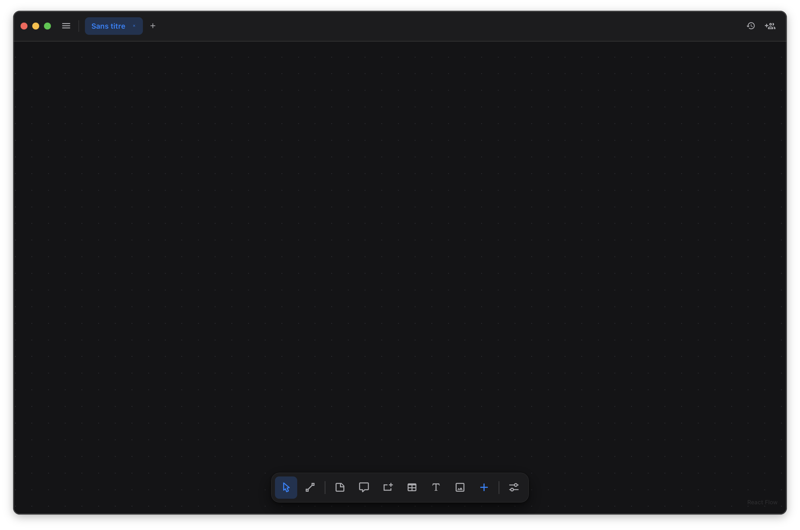

# Nodra

A self-hosted, local-first diagram editor for **cloud architecture and database schemas** —
an open alternative to Lucidchart. Nodra is built as a **minimal core + downloadable plugins**
(inspired by the SimplyTerm model): the core owns the canvas, collaboration, sharing and
persistence; everything pluggable — icon packs, importers/exporters, side panels — is a plugin
you install.

Runs as a **desktop app** (Tauri) or in the **browser** via `-serve`. No account, no server,
no subscription — your work stays on your machine.



## Architecture

**The core ships empty of pluggable things.** It provides only:

- a [ReactFlow](https://reactflow.dev/) canvas with generic node types — groups/containers, sticky
  notes, comments, free text, ER/DB tables, a generic icon node — and editable, labeled edges;
- real-time collaboration (Yjs), document sharing, autosave + a local document library with snapshots;
- **PNG / SVG** export (DOM snapshot) and the native **`.json`** diagram format;
- the **plugin host SDK** + registries.

**Plugins** add everything else — AWS / GCP / Azure icon packs, Terraform `.tfstate` /
draw.io / Mermaid import & export, custom panels, and more. They are:

- **loaded from disk at startup**, and served to **both** desktop (Tauri commands) and web
  (`-serve` exposes them over HTTP) — so the web build gets them too, with no bundling;
- **self-contained JavaScript** (React / `@xyflow/react` / Iconify are provided by the host, so
  one plugin `.zip` works on macOS, Windows and Linux);
- declared per-diagram: a saved file records which plugins it uses, so opening it elsewhere offers
  to install the missing ones (the data always renders non-destructively meanwhile).

## Quick start (development)

Requires Node and the **Rust toolchain** (<https://rustup.rs>) for the desktop build.

```bash
npm install

npm run tauri dev        # desktop app (loads installed plugins from disk)
# — or web only —
npm run dev              # Vite dev server at http://localhost:5173
```

Build:

```bash
npm run build            # typecheck + production web bundle
npm run tauri build      # desktop bundles (per-OS; signing/notarization is separate)
```

Web server mode (serves the built app + installed plugins over HTTP):

```bash
npm run build
cargo run --manifest-path src-tauri/Cargo.toml -- -serve --port 1420
```

## Plugins

The core is intentionally bare — install plugins to make it useful.

- **Write one:** [`docs/PLUGIN-AUTHORING.md`](docs/PLUGIN-AUTHORING.md) — a step-by-step tutorial
  (manifest, the host SDK, a worked example, the build, publishing).
- **Dev loop:** [`docs/PLUGINS-DEV.md`](docs/PLUGINS-DEV.md) — build with `npm run build:plugin`,
  point the app at a dev folder (Settings → Developer), and get **automatic hot-reload** on save.
- **Install:** Settings → Plugins — from the registry, a local `.zip`, or your dev folder.
- **Registry:** [arediss/nodra-plugin-registry](https://github.com/arediss/nodra-plugin-registry).

> Plugins stay **JS/WASM** (never native code), so a single artifact is cross-platform and a new
> plugin never requires re-signing the app. Genuinely native/heavy work belongs in the core (Rust)
> or a signed Tauri sidecar.

## Stack

[Tauri](https://tauri.app/) (Rust) · React 18 · [ReactFlow](https://reactflow.dev/)
(`@xyflow/react`) · [Zustand](https://github.com/pmndrs/zustand) ·
[Yjs](https://github.com/yjs/yjs) (collaboration) · [Vite](https://vitejs.dev/) ·
[esbuild](https://esbuild.github.io/) (per-plugin builds).

## License

[MIT](LICENSE) © Quentin Cattoen
